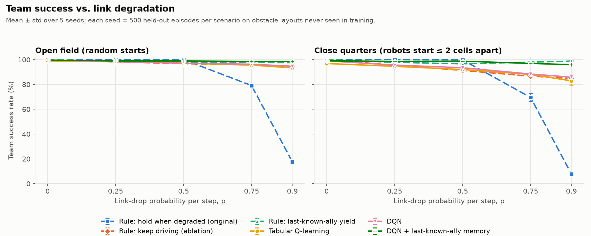
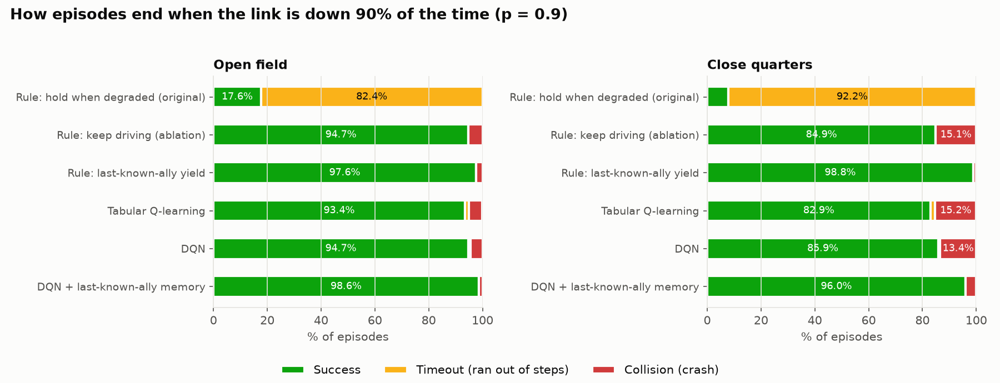
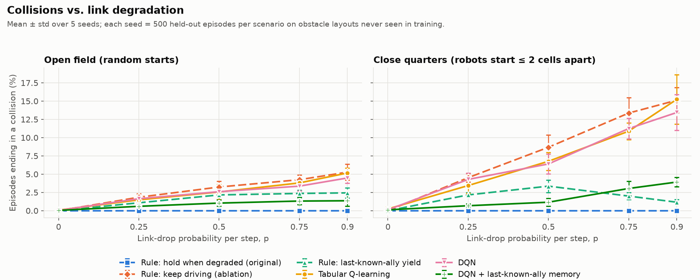
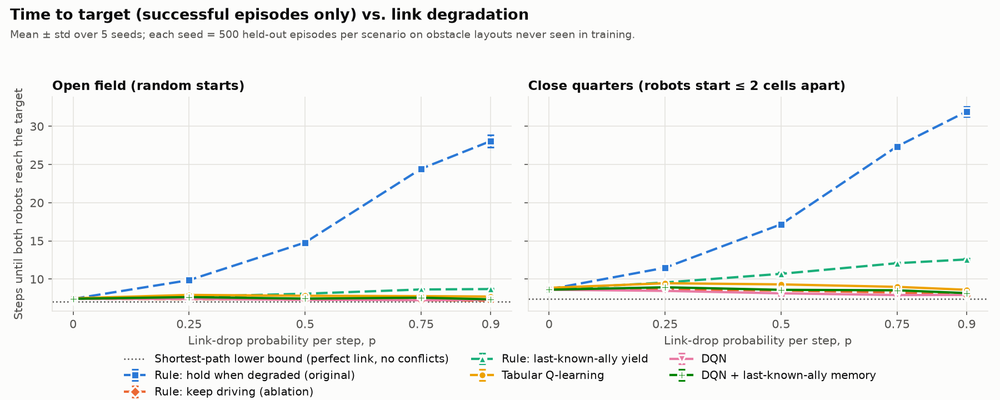
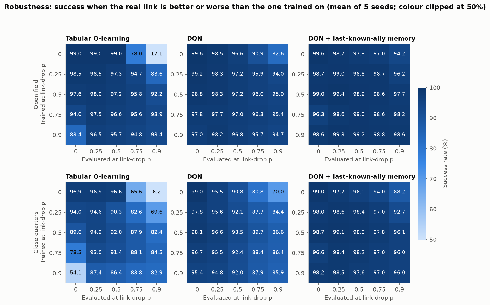
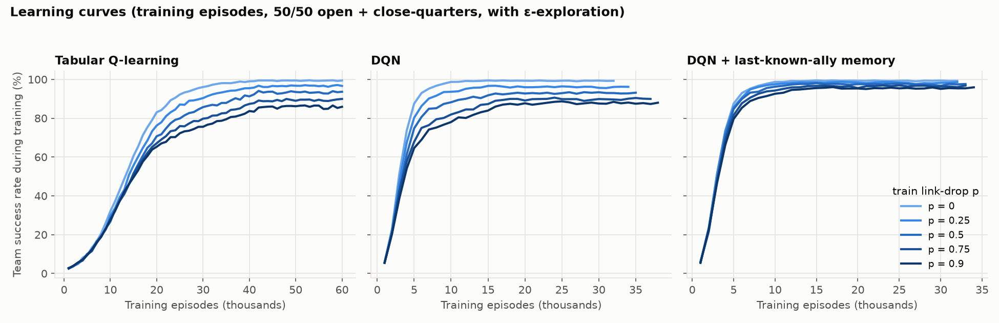
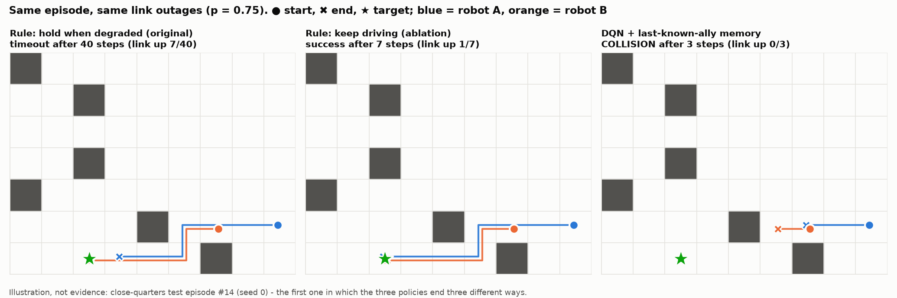

# Multi-Agent RL Under Degraded Communications: full write-up

This is the long version of the [README](../README.md), with every table and figure.

**Two simulated robots have to reach a shared target while their radio link keeps dropping. I measured what the old "Hold when comms are degraded" rule costs, and whether tabular Q-learning and DQN policies handle it better.**

This project builds on my UMass Boston Senior Design project. There, two Raspberry Pi robots move on a 7x9 grid toward a target, and their link can be RF, optical-wireless, or degraded. When the link was degraded, the rule-based controller simply forced **Hold**. I wrote the tabular Q-learning code for that project. This repo moves the setup into a simulator built from scratch, so the question can be tested with many seeds and held-out maps.

## The question

1. **How much does losing the communication link hurt two cooperating robots?**
2. **Can learned policies (tabular Q-learning, a small DQN, and a DQN with memory of the ally's last-known position) cope better than "Hold when degraded"?**

Short answer:

- When the link is usually up (drop rate p ≤ 0.5), the Hold rule is the safest policy. It never crashes and still finishes almost every mission. The cost is time: at p = 0.5 in open field it needs 14.78 steps, while the other policies need 7.29-8.09.
- At p = 0.9 the Hold rule collapses to **17.6%** success in open field and **7.8%** in close quarters.
- **DQN with last-known-ally memory** reaches **98.6%** and **96.0%** in the same conditions.
- Most of the rescue comes from simply **not holding**. The memory is what keeps the robots from crashing afterwards.
- A simple hand-written rule that uses the same memory still beats the DQN in close quarters when the link is very poor (p ≥ 0.75), although it is slower.

## Data / Environment

There is no dataset. Everything comes from a small gridworld written in pure Python/NumPy (`src/env.py`, no gym).

| Piece | What it is |
|---|---|
| Grid | 7 rows x 9 columns with 6-10 static obstacle cells. Every layout is checked so all free cells are connected. |
| Agents | 2 robots and 1 shared target. Both robots move at the same time: Hold, N, E, S, W. |
| Link | Each step the link is **down with probability p** (i.i.d.), with p in {0, 0.25, 0.5, 0.75, 0.9}. The link is symmetric, so either both robots can talk or neither can. RF and optical are both treated as "link up", because this study is about losing the link, not about which medium carries it. |
| What a robot senses | Its own cell and the target offset. It knows the static map, so it knows its shortest-path distance to the target and which moves go "downhill" (one step closer). It has 4 bumper bits for obstacles. It sees the **ally's cell only while the link is up**. It also keeps the ally's last-known cell and how many steps old that sighting is. Only the "memory" policies use that. Both robots know each other's start cell, since they are deployed together. |
| Rewards (per robot) | −0.1 per step while driving. +10 for reaching the target (the robot then docks and leaves the grid). −10 to both robots for a collision, **and a collision ends the episode** (a crash is a failed mission). |
| Collision | Both robots enter the same non-target cell, they swap cells, or one drives into the other while it stands still. The target cell can hold both robots. |
| Success | Both robots docked within **40 steps** with no collision. |
| Scenarios | **Open field**: target and both starts uniformly random. **Close quarters**: the robots start at most 2 cells apart and both are at least 4 steps from the target, so their paths overlap. This is where the link matters most. |
| Held-out test | 400 training layouts and a **disjoint** pool of 200 test layouts (verified to share no layout). For each seed, every policy sees the **same 500 test episodes per scenario**: same maps, same starts, and the same per-step link outages (common random numbers). |

## Approach

Six policies. All of them use exactly the same sensors.

| Policy | What it does |
|---|---|
| **Rule: hold when degraded (original)** | Mirrors the Senior Design system. It steps greedily toward the target (a downhill move). While the link is up it uses a right-of-way rule: the robot closer to the target goes first, and the other never enters a cell the ally could reach. When the link is down, it **Holds**. |
| Rule: keep driving (ablation) | Same greedy rule, but it keeps driving when the link is down (without any ally information). This tests whether the gain comes from "just don't hold". |
| Rule: last-known-ally yield | A hand-written rule that uses memory. When the link is down, it Holds only if the ally was last seen within 2 cells, had right-of-way, and that sighting is at most `k` steps old. `k` was picked on **training** layouts: all candidates scored within 0.2 points, and k = 5 was chosen. |
| **Tabular Q-learning** | One Q-table shared by both robots, each acting on its own local state. The state has 89,856 possible codes: downhill mask × bumper mask × distance (capped at 12) × ally code. The ally code is link down, ally docked, ally far, or ally's exact offset within 2 cells × right-of-way. It uses a visit-count step size α = n(s,a)^−0.6 (floor 0.01), γ = 0.95, ε from 1 to 0.05 over the first 70% of 60k episodes. |
| **DQN** | Double DQN with a shared network (34 inputs → 128 → 128 → 5, ReLU). It gets the same information as the table plus normalised positions. Settings: MSE loss, Adam 5e-4, replay 100k, batch 128, target sync every 500 updates, 16 parallel envs, 400k env steps. |
| **DQN + last-known-ally memory** | Same network, but the ally block holds the **last-known** ally cell (relative to where the robot is now) and its age, not only what the link shows right now. |

- **One training run per (policy, p, seed).** Training episodes are a 50/50 mix of open-field and close-quarters starts. Each trained model is then evaluated at *every* p, which gives the robustness heatmap below.
- **Seeds:** 5 per config, for 75 trained models in total. Results are reported as mean ± std over seeds. Each seed is evaluated on 500 held-out episodes per scenario.
- **Compute:** the full run (`run_experiments.py`) took **5.96 min wall-clock** on an Apple M3 Max with 12 worker processes, which is 65.6 CPU-minutes of training summed. I benchmarked the tiny Q-network on both devices, and **CPU beat the Apple GPU (MPS)**: 0.49 ms vs 2.06 ms per gradient update, and 0.04 ms vs 0.70 ms per action. For a network with about 22k parameters, the kernel-launch overhead dominates on the GPU. Numbers are in `results/results.json`.

## Results

### Headline: success vs. link degradation



**Team success rate (%)**, mean ± std over 5 seeds (from `results/tables.md`):

*Open field*

| Policy | p=0 | p=0.25 | p=0.5 | p=0.75 | p=0.9 |
|---|---:|---:|---:|---:|---:|
| Rule: hold when degraded (original) | 100.0 ± 0.0 | 100.0 ± 0.0 | 100.0 ± 0.0 | 79.2 ± 1.5 | 17.6 ± 1.4 |
| Rule: keep driving (ablation) | 100.0 ± 0.0 | 98.2 ± 0.5 | 96.8 ± 0.8 | 95.8 ± 0.6 | 94.7 ± 1.1 |
| Rule: last-known-ally yield | 100.0 ± 0.0 | 98.9 ± 0.4 | 97.8 ± 0.7 | 97.6 ± 0.5 | 97.6 ± 0.7 |
| Tabular Q-learning | 99.0 ± 0.4 | 98.5 ± 0.7 | 97.2 ± 1.0 | 95.6 ± 0.3 | 93.4 ± 1.0 |
| DQN | 99.6 ± 0.3 | 98.3 ± 0.5 | 97.2 ± 0.8 | 96.3 ± 0.8 | 94.7 ± 0.8 |
| DQN + last-known-ally memory | 99.6 ± 0.3 | 99.0 ± 0.4 | 98.9 ± 0.5 | 98.6 ± 0.6 | 98.6 ± 0.8 |

*Close quarters*

| Policy | p=0 | p=0.25 | p=0.5 | p=0.75 | p=0.9 |
|---|---:|---:|---:|---:|---:|
| Rule: hold when degraded (original) | 100.0 ± 0.0 | 100.0 ± 0.0 | 99.8 ± 0.1 | 69.6 ± 3.1 | 7.8 ± 1.4 |
| Rule: keep driving (ablation) | 100.0 ± 0.0 | 95.5 ± 0.6 | 91.3 ± 1.7 | 86.6 ± 2.1 | 84.9 ± 1.7 |
| Rule: last-known-ally yield | 100.0 ± 0.0 | 97.8 ± 0.3 | 96.6 ± 0.9 | 98.0 ± 0.5 | 98.8 ± 0.4 |
| Tabular Q-learning | 96.9 ± 0.7 | 94.6 ± 1.0 | 92.0 ± 1.3 | 88.1 ± 1.3 | 82.9 ± 3.3 |
| DQN | 99.0 ± 0.7 | 95.6 ± 1.0 | 93.5 ± 1.3 | 88.4 ± 1.1 | 85.9 ± 2.1 |
| DQN + last-known-ally memory | 99.0 ± 0.7 | 98.6 ± 0.8 | 98.8 ± 0.5 | 97.0 ± 1.0 | 96.0 ± 0.7 |

### Detail at p = 0.9 (link down 90% of steps)

| Policy | Open: success % | Open: collision % | Open: steps | Close: success % | Close: collision % | Close: steps |
|---|---:|---:|---:|---:|---:|---:|
| Rule: hold when degraded (original) | 17.6 ± 1.4 | 0.0 ± 0.0 | 28.06 ± 0.78 | 7.8 ± 1.4 | 0.0 ± 0.0 | 31.93 ± 0.64 |
| Rule: keep driving (ablation) | 94.7 ± 1.1 | 5.3 ± 1.1 | 7.17 ± 0.08 | 84.9 ± 1.7 | 15.1 ± 1.7 | 7.92 ± 0.08 |
| Rule: last-known-ally yield | 97.6 ± 0.7 | 2.4 ± 0.7 | 8.70 ± 0.08 | 98.8 ± 0.4 | 1.2 ± 0.4 | 12.57 ± 0.13 |
| Tabular Q-learning | 93.4 ± 1.0 | 5.2 ± 0.7 | 7.72 ± 0.28 | 82.9 ± 3.3 | 15.2 ± 3.4 | 8.60 ± 0.24 |
| DQN | 94.7 ± 0.8 | 4.5 ± 0.7 | 7.29 ± 0.20 | 85.9 ± 2.1 | 13.4 ± 2.4 | 7.93 ± 0.17 |
| DQN + last-known-ally memory | **98.6 ± 0.8** | 1.4 ± 0.7 | 7.35 ± 0.16 | 96.0 ± 0.7 | 3.9 ± 0.6 | 8.17 ± 0.24 |

"Steps" counts only successful episodes. The shortest-path lower bound is 7.066 steps in open field and 7.435 in close quarters. Timeouts make up the rest of each row, and every row is in `results/tables.md`.







### How much does losing the link hurt?

- **With the Hold rule, a lot, and it is all timeouts.** Success stays at 100% up to p = 0.5, but time to target doubles: 7.41 → 14.78 steps in open field. It then falls to 79.2% → 17.6% (open) and 69.6% → 7.8% (close) at p = 0.75 / 0.9. It never crashes. It just runs out of time waiting.
- **The link's real job is collision avoidance, not navigation.** The keep-driving rule has no ally information during outages, yet it still reaches 94.7% in open field at p = 0.9. In close quarters, though, 15.1% of its episodes end in a crash.

### Can learned policies cope better?

- **Against the original rule at high drop rates: yes, by a wide margin.** At p = 0.9 every learned policy is above 82% success, while the Hold rule gets 17.6% / 7.8%.
- **At p ≤ 0.5, no.** The Hold rule's success rate is equal to or higher than every learned policy there (it is 100% / 99.8%). What the learned policies offer instead is speed: roughly half the steps at p = 0.5, in exchange for occasional crashes (for example, DQN+memory has 1.2% collisions in close quarters at p = 0.5).
- **Plain DQN and tabular Q-learning did not beat the trivial keep-driving ablation.** At p = 0.9 in close quarters: 85.9% and 82.9% vs 84.9%. Without memory, a robot has nothing to reason about during an outage, so the best it can learn is "keep driving". Tabular also does slightly *worse* than the rules at p = 0 (99.0% / 96.9%). Its greedy policy sometimes gets stuck, holding or oscillating until the step cap (0.9% / 2.9% of episodes time out).
- **Memory is what matters.** DQN+memory cuts close-quarters collisions at p = 0.9 from 15.1% (keep driving) to 3.9%. In open field it is the best policy at p ≥ 0.75, and it matches or beats the hand-written memory rule at every p > 0. The Hold rule is still higher at p ≤ 0.5.
- **A hand-written memory rule beats DQN+memory in close quarters at p ≥ 0.75** (98.0 / 98.8% vs 97.0 / 96.0%). The rule gets there by waiting, which makes it slower: 12.57 vs 8.17 steps at p = 0.9. DQN+memory is ahead of the memory rule in close quarters at p = 0.25 and 0.5.

**How the DQN+memory policy avoids crashes.** I expected it to learn to wait. It almost never does: at "risky moments" (link down, ally last seen within 2 cells) it Holds only 1.4% of the time in close quarters, plus 3.7% of the time it bumps into an obstacle, which also leaves it in place. Instead, **it steers away**. When it has two equally good downhill moves, it picks the one leading away from the ally's last-known cell **91.9%** of the time. The rules and the no-memory learners do this 50-55% of the time, which is about chance. The full breakdown is in `results/tables.md`.

### Robustness: training link ≠ deployed link



- A **Q-table trained with a perfect link (p = 0) and deployed at p = 0.9 scores 17.1% / 6.2%**, almost exactly the original Hold rule. The reason: it has never seen a "link down" state. Those rows of the table are all zeros, and `argmax` of zeros is action 0, which is Hold. **The table rediscovers the old rule by accident.**
- Policies trained only on a bad link also get worse when the link is *good*. Tabular trained at p = 0.9 and evaluated at p = 0 drops to 54.1% in close quarters, because it rarely saw link-up states during training.
- DQN+memory trained at p = 0.5 holds up well across every deployed link: 96.1-99.4% in both scenarios.

### Learning curves and an example episode





*Illustration, not evidence.* This is the first close-quarters test episode (seed 0, p = 0.75) in which the three policies end three different ways. The selection rule was fixed before looking. It happens to show a DQN+memory **failure**. The link is down the whole time. The orange robot keeps pushing into an obstacle, which effectively means waiting, and the blue robot drives into it from behind. The Hold rule times out one cell from the target, and keep-driving gets through.

## What didn't work / limitations

- **Huber loss made the DQN never yield.** With the standard Huber (smooth-L1) loss, both DQN variants learned "always drive" (Hold on about 0.1% of link-down steps). In a one-seed development check at p = 0.9, on validation episodes built from *training* layouts, DQN+memory reached 97.5% (open) / 89.9% (close). Switching to MSE raised that to 98.7% / 96.1%. My explanation: Huber caps the gradient from rare −10 collision errors at the same size as ordinary errors. Other changes I tried in the same check did not help: lower final ε, learning rate 1e-3, γ = 0.99, a wider 256-unit network, and 2x more updates per step. These development numbers are not regenerated by `run_experiments.py`.
- **A Manhattan-distance "greedy" baseline was a bad baseline.** It got stuck behind obstacles and succeeded in only 88.6% of episodes *with a perfect link* (a 1,000-episode development check). I switched every policy to shortest-path "downhill" moves so the study measures communication, not navigation. Because of that, the robots know the static map, which is a real simplification.
- **The first Q-table versions looped.** Distance was bucketed as {1, 2, 3+} and the step size was a constant α = 0.1. Moving *away* from the target looked free inside the "3+" bucket, and noisy Q-values flipped the greedy action. Exact distance (capped at 12) plus a visit-count step size fixed most of it. Tabular is still the weakest learner here.
- **The learned policies are not strictly better than rules.** A hand-written memory rule of a few lines is the best close-quarters policy at p ≥ 0.75. The value of RL here is that it found a *different* strategy (steer away rather than wait) from reward alone. It did not dominate.
- **Simulation only.** None of this ran on the Raspberry Pi robots.
- Other simplifications:
  - Link drops are i.i.d. per step, while real links fail in bursts.
  - The link is symmetric.
  - Localisation is perfect and moves are discrete and simultaneous.
  - There are exactly 2 robots.
  - A collision always ends the mission.
  - The 40-step cap decides how badly the Hold rule times out. A looser deadline would make Hold look better.
- The DQN input is hand-designed features, not raw grid images. The ally-offset one-hot and the "priority" bit give the learners the same concepts the rules use.
- 5 seeds × 500 episodes per scenario is enough to separate the large effects here. Differences of about 1 point, such as 98.6 vs 97.6, are within about 1-2 std and should not be over-read.

## How to reproduce

```bash
cd multi-agent-rl-degraded-comms
python -m venv .venv && source .venv/bin/activate      
pip install -r requirements.txt

python run_experiments.py            # full run: 75 trained models + rules, all figures/results (~6 min, 12 workers, M3 Max)
python run_experiments.py --quick    # ~30 s smoke test, writes to _quick/ instead
```

Everything is seeded: layouts, episodes, link outages, network initialisation, and exploration. Two full runs on this machine produced identical tables. Outputs:

- `results/results.json`: config, runtime, device benchmark, and headline metrics
- `results/tables.md`: every table above
- `results/summary.csv`: mean/std per policy × scenario × p
- `results/metrics_per_seed.csv`
- `results/cross_p_generalization.csv`
- `results/training_curves.csv`
- `results/run_log.txt`
- `figures/*.png`
- Trained models go to `models/`, which is git-ignored.

Code map:

- `src/env.py`: gridworld, link model, layouts
- `src/policies.py`: rules
- `src/features.py`: tabular and DQN encoders
- `src/tabular.py`, `src/dqn.py`: learners
- `src/evaluate.py`: lock-step evaluation
- `src/experiment.py`: job definitions
- `src/plots.py`: figures
- `src/bench.py`: CPU vs MPS benchmark
